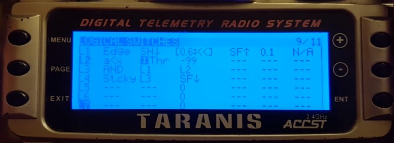

# Coletânea de diversas dicas do Rádio Taranis

## Dica do Bardwell para ajustar o volume do rádio de forma global
[Link](https://www.youtube.com/watch?v=zZZbnNzaVAA)

## Dica do Bardwell sobre Arm Switch com proteção

[1(#)

### Lembrar de anotar em detalhes sobre como funciona porque explica vários recursos como Edge e Sticky
[Safer Switch Arming on FrSky Taranis](https://www.youtube.com/watch?v=bv3VJ1jznw8)

### Dica de como criar uma proteção para apenas desarmar os motores se o throtle estiver todo abaixado
[This arm-switch setup is dangerous, and you shouldn't use it](https://www.youtube.com/watch?v=r7GxIlPV1Xc&t=669s)

## Diversos comandos com leitura de telemetria e ajustes de delay e o mínimo de tempo que o valor deve estar On
[How to make your Taranis read out low voltage](https://www.youtube.com/watch?v=2xt623VAMEk)
